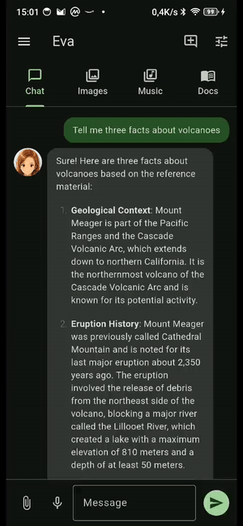
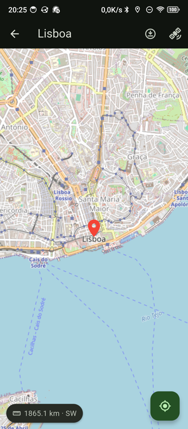
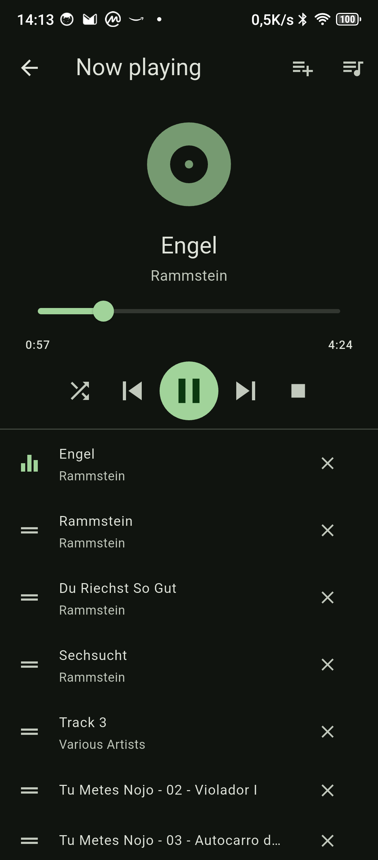
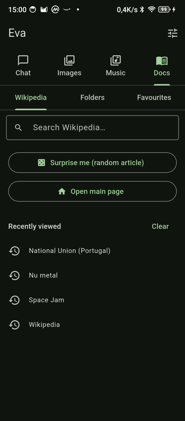
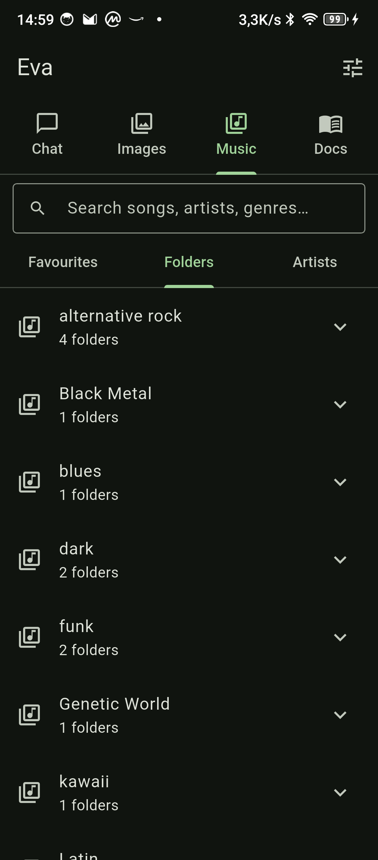
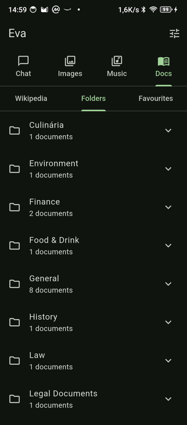
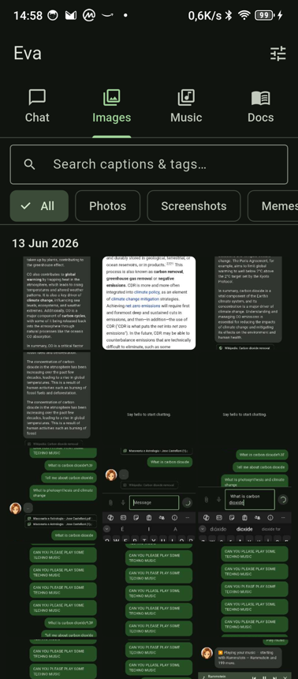
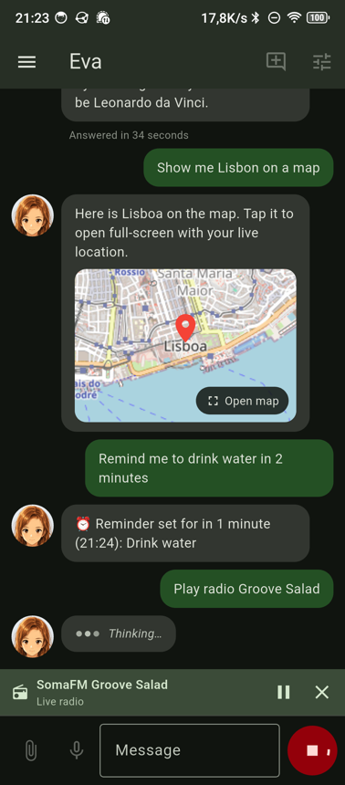
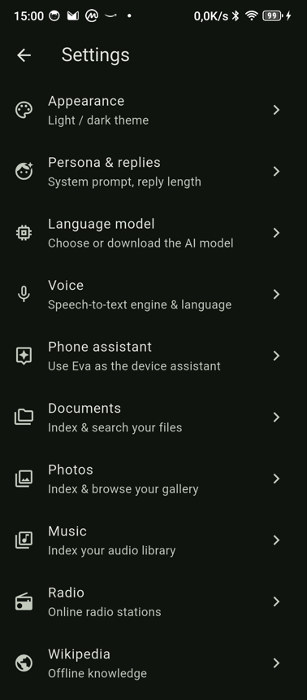
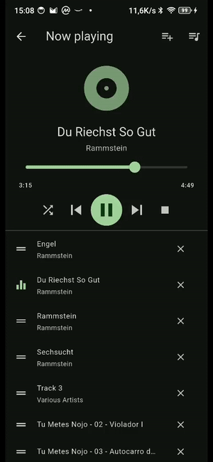

# Eva

**Eva is a fully offline AI assistant for Android.** The language model, speech
recognition, text‑to‑speech, document search, maps, music and Wikipedia all run
on the phone. No account, no cloud, nothing leaves the device.

<p align="center">
  
</p>

**[⬇ Download the latest APK](https://github.com/geograms/eva/releases/latest)**
(arm64‑v8a) — or run `binary/get-latest-apk.sh`.

---

## What Eva does

Eva is a chat assistant *and* an offline media/knowledge hub. The home screen
has four tabs — **Chat**, **Images**, **Music**, **Docs** — and music keeps
playing in the background with lock‑screen controls while you use the rest.

<table>
  <tr>
    <td align="center"><br/><b>Chat, grounded in your data</b></td>
    <td align="center"><br/><b>Offline maps & navigation</b></td>
    <td align="center"><br/><b>Full music player</b></td>
  </tr>
  <tr>
    <td align="center"><br/><b>Offline Wikipedia reader</b></td>
    <td align="center"><br/><b>Music sorted by LLM genre</b></td>
    <td align="center"><br/><b>Documents categorised by the LLM</b></td>
  </tr>
  <tr>
    <td align="center"><br/><b>Photo gallery + tags</b></td>
    <td align="center"><br/><b>Online radio</b></td>
    <td align="center"><br/><b>Per‑area settings</b></td>
  </tr>
</table>

---

## Features

### 💬 Chat & assistant
- On‑device chat with selectable models (LFM2.5, Qwen3, vision models),
  downloaded on demand or sideloaded from a folder.
- **Grounded answers**: Eva fuses three sources — your documents (hybrid vector
  + full‑text retrieval), the offline Wikipedia, and the model's own
  knowledge — and cites them. Tap a citation to open the source at the passage.
- **Digital assistant**: set Eva as the phone's assistant and invoke it with a
  power‑button hold — it listens, answers, and speaks the reply.
- **Voice in/out**: offline streaming speech‑to‑text (English) or the phone's
  recognizer (many languages), plus spoken replies.
- **Vision**: attach a photo and ask about it (with a vision model selected).
- Persistent chat history with a conversation drawer; reply‑length control;
  each answer shows how long it took.

### 🗺️ Offline maps & navigation
- Ask *"where is X"* / *"show me X on a map"* → an expandable map tile in chat
  that opens full‑screen with your **live GPS dot** and a distance/bearing
  readout.
- *"route to X"* draws a **walking path** from your position to the destination.
- Streets **and** satellite layers, cached on demand to a folder you choose, so
  places and routes you've viewed keep working offline. "Save this area
  offline" caches a region for later.

### 🎵 Music — a full offline player
- Browse **Favourites** (most played), **Folders**, and **Artists**.
- Folders are grouped by an **LLM‑assigned genre → subgenre** (so bands without
  a genre tag still get sorted — e.g. _alternative rock_, _black metal_,
  _funk_).
- A **"+"** on every track adds it to the playlist; tap the now‑playing bar to
  open a full player: seek bar, transport, **shuffle/random**, and the current
  queue (jump / remove). Save, load and delete **named playlists**.
- **Background playback** with lock‑screen / notification controls.

<p align="center">
  
</p>

### 📚 Docs — an e‑reader
- **Wikipedia**: read the offline encyclopedia with **search‑as‑you‑type**
  (ranked by article popularity), a random article, the main page, and a
  recently‑viewed list.
- **Folders**: documents categorised by the LLM into **genre → subcategory**,
  with live progress, reusing the already‑extracted text.
- **Favourites**: recently read, starred, and often‑read documents.
- PDFs **resume at the last page** ("Page X of Y"); Word/EPUB/text render in
  full and resume your scroll position with a "% read".
- Index PDFs, Word, PowerPoint, Excel and EPUB — fully on‑device.

### 🖼️ Images — a gallery
- Search by the on‑device **caption** (a vision pass labels photos while
  charging) and by your own **tags**; filter by category (photos / screenshots /
  memes), group by day, and view **GPS‑located** photos on the map.

### 📻 Radio · ⏰ Reminders
- Online **radio stations** with play counts/favourites; *"play radio …"* from
  chat.
- **Timed reminders** — *"remind me … in 15 minutes"* / *"at 7pm"* (EN/PT) —
  fire as system notifications even when Eva is closed.

### ⚙️ Settings & storage
- Settings organised into per‑area panels (Appearance, Language model, Voice,
  Documents, Photos, Music, Radio, Wikipedia, Maps, Reminders, Storage).
- **One unified storage folder** for all data (models, Wikipedia, documents, map
  cache); choosing a new folder (e.g. an SD card) **moves everything** so
  nothing has to be re‑downloaded.

---

## Everything stays on the device

Eva is built to work with no connectivity. The model, embeddings, speech, the
document index (a sharded int8 vector index fused with full‑text search), the
ZIM‑backed Wikipedia, GPS, cached map tiles and your media all live on the
phone. Internet is only used for *optional* on‑demand downloads (a model, a
Wikipedia edition, a map tile, lyrics, a radio stream) — never for your data.

## Architecture

- **Flutter** app (`flutter/example/lib/`) talking over FFI to:
  - the **Cactus** inference engine (`libcactus.so`) for the LLM/VLM/embeddings,
  - **libzim** (`libzimffi.so`) for the offline Wikipedia.
- A background isolate runs inference; gated background passes (photo
  captioning, document & music categorisation) use the model while charging /
  idle and yield instantly to chat.
- Native libraries are content‑addressed and built by a Gradle hook (an NDK is
  only needed when engine sources change).

## Repository layout

- `flutter/example/` — the Eva Flutter app (`lib/`), its native FFI builds
  (`native/`, `native_zim/`) and on‑device integration tests.
- `cactus/`, `cactus-engine/`, `cactus-graph/`, `cactus-kernels/` — the Cactus
  inference engine sources compiled into `libcactus.so` (see LICENSE).
- `python/` — the host‑side transpiler that converts HuggingFace models into
  loadable bundles (used by CI; the phone only loads pre‑transpiled bundles).
- `.github/workflows/android-release.yml` — CI: transpiles missing model
  bundles and publishes the APK to the GitHub release.
- `binary/` — convenience script to fetch the latest released APK.

## Building

```bash
cd flutter/example
flutter build apk --release --target-platform android-arm64
```

The native library is built (or restored from a local cache) automatically by a
Gradle hook; an Android NDK is only needed when engine sources actually change.

## Credits

Built on the **Cactus** inference engine (Cactus Compute, Inc. — see LICENSE).
Eva is maintained by **Geogram**.
